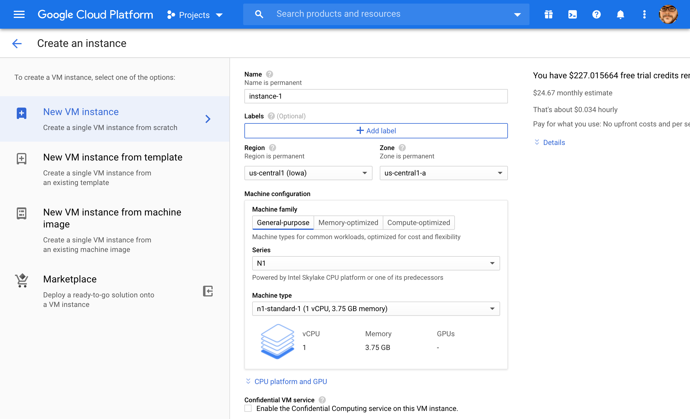
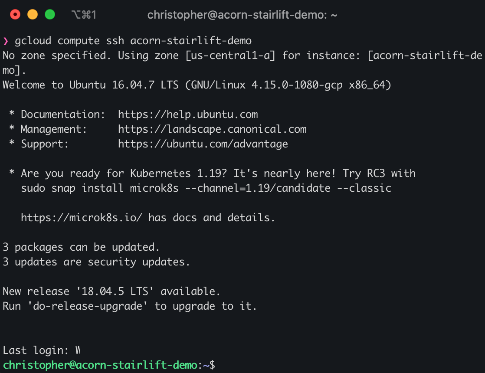
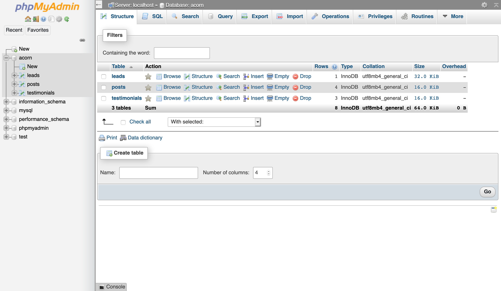
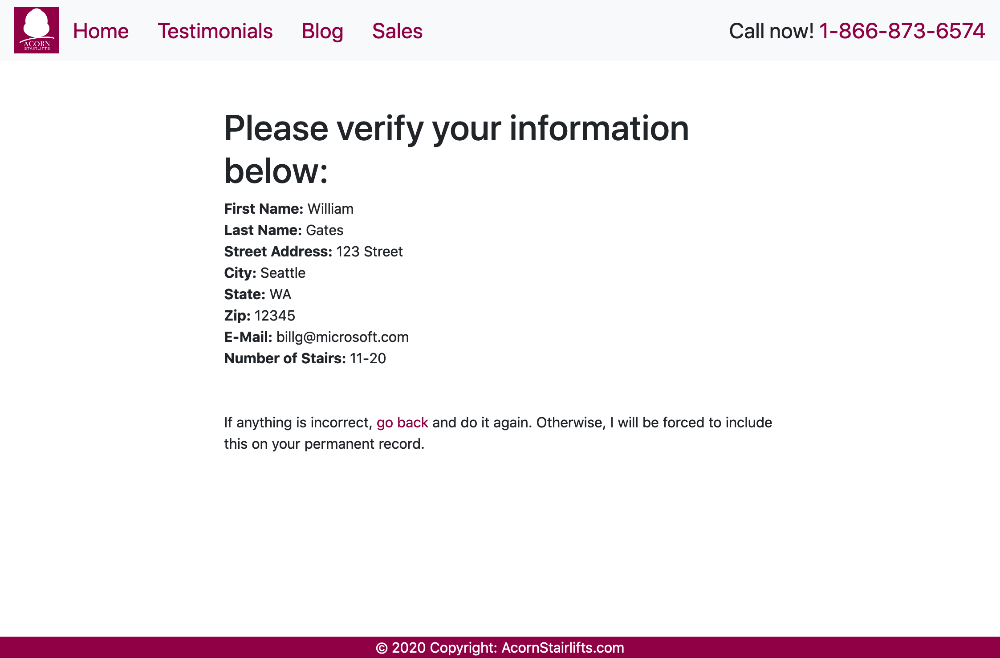

# Acorn Stairlifts 

As part of an interview process, I was tasked with designing a small web application that demonstrated some relevant skills for Acorn Stairlifts. The parameters for the project allowed for a lot of freedom, and I was encouraged to be creative. I was given some sample marketing sites to consider too. 

#### Objectives

* Demonstrate backend code skills using PHP / MySQL

* Create a one-page micro-website

* OK to use branding, copy, etc

* Be original

* Show thought processs

  

## Initial thoughts

With only 48 hours to complete the project, I had to be realistic about what could be accomplished. It was essential to connect and query a database and elegantly display information about Acorn Stairlifts.

I decided to use content from the official website to generate a page with blog posts, testimonials, and a functional web form.

Before I could get started on the code, I needed to figure out how I was going to host and deploy the live demo. 

### Google Cloud Platform

I decided to use Google Cloud Platform and create a virtual machine instance with a public IP address. 



I configured the virtual machine to be a micro instance with one vCPU and 614MB of memory. I used a minimal Ubuntu 16.04 LTS image for the operating system.



Once the machine was created, I used SSH to further configure my new server. I setup Apache, MySQL, and PHP on the machine.

With the host server configured, I went to my website's DNS page and created an `a record` to point the server's IP to an easy to remember URL.


## Creating the UI 

Now that I had my hosting solution figured out, I began development in my local environment. 

I created a basic layout with top navigation and a main content area. I initally wanted to contain everything to a single page. It would have been very messy and confusing without some additional frontend tooling. I did not have time to add these kinds of features for this project, so I created 4 seperate pages:

* Home
* Testimonials
* Blog
* Sales

Home would be my `index.php` and contain some basic product information. The remaining three pages would need to connect with the MySQL database. I created a db called acorn and three tables to correspond with the front end.

### Database population


After creating the tables and the database, I filled them with content I found on various Acorn marketing sites. I copied source code to perserve HTML formatting so that blog posts and other content were displayed accurately.

### CSS: Style Elements

I chose to use Bootstrap to style the basic elements of the page. I originally wanted a one page layout, but it would have required additional JavaScript coding to properly display the information. Bootstrap covers a lot of the basic style elements and gives them a professional modern look.

There was still some custom CSS necessary to give a more cohesive branding feel to the site. I used Acorns official logo to extract the brand color, a deep red with a bit of pink. I used this color as the primary styling element on the website. I updated link colors to reflect it, created a solid color footer and added it to the logo in the nav.

### Logo
Speaking of the logo, I actually made that logo myself using Adobe Illustrator. I wanted a scalable graphic and didn't have luck finding one on the web. 

I used it for the nav, and also used the same image to create the `favicon` for the browser tab.  


## Putting it All Together
With my database built out and my front end design taking shape, it was time to connect the two.

I chose to use  [PHP Data Objects / PDO](https://www.php.net/manual/en/book.pdo.php) for my connection scripts. 

I had previous experience using mysqli, so some of this was new to me, but the concept is the same.

This first part is encapsulated in a `try` statement and the subsequent `catch` will provide appropriate messaging if there is a problem with making the connection. 

```PHP
//Attempt DB connection
$conn = new PDO("mysql:host=$servername;dbname=acorn", $username, $password);

$conn->setAttribute(PDO::ATTR_ERRMODE, PDO::ERRMODE_EXCEPTION);

// Query Database
$stmt = $conn->query("SELECT * FROM WHATEVER");
$whatevers = $stmt->fetchAll(PDO::FETCH_OBJ);
```

I imported the DB credentials from another file and then in this example a query is run and the results are collected into an object called whatevers.

I used this general method for both the `blog` and `testimonials` pages.

Then, in order to display the content from the tables into the HTML, I used a PHP foreach loop. 

Here's an example pulled from the blog code:
```HTML
foreach ($posts as $post) { ?>
<div class="container" style="max-width:650px;">

<!-- header image -->
image ?>">
       
<!-- blog title -->
<h1>
<?php echo $post->title ?> 
</h1>
        
<!-- blog author -->
<h2 class="text-muted">
<?php echo $post->author ?></span></h2>

<!-- blog date -->
<p class="lead"><?php echo $post->created_at ?></td>

<!-- blog text content -->
<p><?php echo $post->body ?></p>
</div>
```

In the loop, I built the html elements around the data I wanted displayed. The php echo statements all feature `$post->databaseColumnName`. This iterates for each post that is in the database. I only had 4 posts in my table, otherwise, this may have been overwhelming and needed additional code.

## Input Validation
For the `sales` page, I was writing information to the DB and this required a different approach. 

I used built-in features from the bootstrap and HTML5 for some basic input validation. 

The sales form was the last feature that I worked on and I ultimately ran out of time before implementing a level of validation that I would consider adequate for `production`. 

I spent a lot of time trying to come up with an efficient method for throwing custom errors. I

In order to prevent against SQL injections, I needed to sanitize any user input that would allow code exceution. 

I passed the filtered `$_POST` data to new variables for use in the database.

```PHP
$newVariableName =sanitize($_POST['variableName']);
```

I used the following function to do this:
```PHP
function sanitize($data) {
    $data = trim($data);
    $data = stripslashes($data);
    $data = htmlspecialchars($data);
    return $data;
  }
  ```

Beyond essential character escaping, I wanted the code to parse the input data and catch obvious user errors. I struggled to find a solution that did exactly what I wanted without creating a waterfall of conditional statements.

I ultimately settled due to time constraints. Late into my research I found the php `list()` function. This allowed me to create a list structure so I could pair the element and a description of the element. 

```PHP
$dataName = array('First Name: ','Last Name: ','Street Address: ','City: ','State: ','Zip: ','E-Mail: ','Number of Stairs: ');
list ($a,$b,$c,$d,$e,$f,$g,$h)= $dataName;
$responses = array($fname, $lname ,$street, $city, $state, $zip, $email, $stairs);
list ($aa, $bb ,$cc, $dd, $ee, $ff, $gg, $hh) = $responses;
echo "<b>$a</b> $aa <br>";
echo "<b>$b</b> $bb <br>";
echo "<b>$c</b> $cc <br>";
echo "<b>$d</b> $dd <br>";
echo "<b>$e</b> $ee <br>";
echo "<b>$f</b> $ff <br>";
echo "<b>$g</b> $gg <br>";
echo "<b>$h</b> $hh <br>";
```

This ran through each of the form inputs and returned them to the user for self-verification. This would be a bad idea in production because it would allow a lot of bad data or null values to be passed. 


Here is an example of a succesful form submission / database update.
