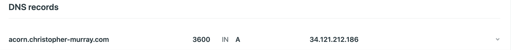

# Acorn Stairlifts 

As part of an interview process, I was tasked with designing a small web application that demonstrated some relevant skills for Acorn Stairlifts. The parameters for the project left a lot of freedom, and I was encouraged to be creative. I was given some sample marketing sites to consider too. 

#### Objectives

* Demonstrate backend code skills using PHP / MySQL

* Create a one-page micro-website

* OK to use branding, copy, etc

* Be original

* Show thought processs

  

## Initial thoughts

With only 48 hours to complete the project, I had to be realistic about what could be accomplished. It was essential to connect and query a database and elegantly display information about Acorn Stairlifts.

I decided to use content from the official website to generate a page with blog posts, testimonials, and a functional web form.

Before I could get started on the code, I needed to figure out how I was going to host and deploy the live demo. 

#### Google Cloud Platform

I decided to use Google Cloud Platform and create a virtual machine instance with a public IP address. 

I configured the virtual machine to be a micro instance with one vCPU and 614MB of memory. I used a minimal Ubuntu 16.04 LTS image for the operating system.

Once the machine was created, I used SSH to further configure my new server. I setup Apache, MySQL, and PHP on the machine.

With the host server configured, I went to my website's DNS page and created an `a record` to point the server's IP to an easy to remember URL.

### Creating the UI 

Now that I had my hosting solution figured out, I began development in my local environment. 

I created a basic layout with top navigation and a main content area. I initally wanted to contain everything to a single page. It would have been very messy and confusing without some additional frontend tooling. I did not have time to add these kinds of features for this project, so I created 4 seperate pages:

* Home
* Testimonials
* Blog
* Sales

Home would be my `index.php` and contain some basic product information. The remaining three pages would need to connect with the MySQL database. I created a db called acorn and three tables to correspond with the front end.

I chose to use Bootstrap to style the basic elements of the page. I originally wanted a one page layout, but it would have required additional JavaScript coding to properly display the information.